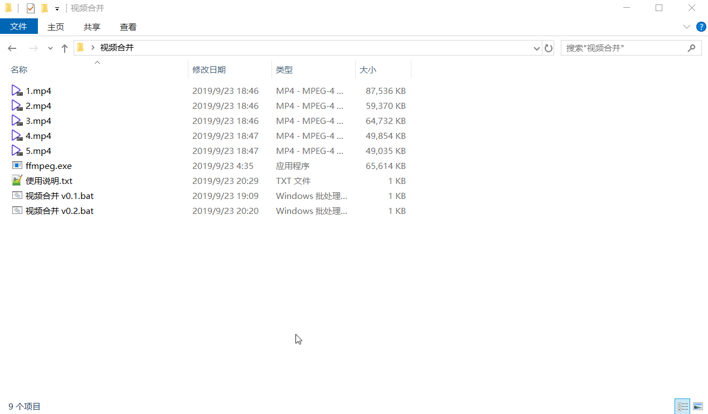

## 简单的 mp4 视频合并

### 前言

> 同事从 XX 智能摄像头中导出他需要的视频，结果居然是一个个以时间戳命名的分割视频，并非一个整体。
>
> 需求：将某个文件夹中的视频，合并为一个整体

### 原理

#### 使用 FFmpeg 工具，用命令直接合并成一个视频。

```bash
ffmpeg -f concat -safe 0 -i fileName.txt -c copy new.mp4
```

> 从 fileName.txt 文件中读取文件名，格式为 
> ```bash
> file 'fileName.mp4'
> ```
> 

### 适用范围

> * Windows 环境下
>* 需要合并的视频格式为 mp4，且在同一个文件夹下
> * 可自行替换 FFmpeg 版本，官网：[http://ffmpeg.org/](http://ffmpeg.org/)
>
>   本处使用的版本为：ffmpeg version N-95027-g8c90bb8ebb Copyright (c) 2000-2019 the FFmpeg developers built with gcc 9.2.1 (GCC) 20190918

### 使用说明

#### 视频合并 v0.1

> 使用
>
> * 将 ffmpeg.exe 和 视频合并 v0.1.bat 一起拷贝到要合并的视频文件夹里
> * 运行 “视频合并 v0.1.bat” 文件即可，在当前视频文件夹中生成一个 new.mp4 文件
>
> 缺点
>
> * 需要拷贝两个文件到需要合并的视频文件夹中
> * 之后还要自己手动删除
>
> 动态图示范：
>
> 

### 视频合并 v0.2

> 该版本在 0.1 版本上修改，更新的目的就是为了解决 0.1 版本中所提的缺点
>
> 使用
>
> * 将需要合并的视频文件夹直接拖到 “视频合并 v0.1.bat” 文件上即可
> * 会在视频文件夹中生成一个 new.mp4 文件
>
> 动态图示范：
>
> 

### 后记

> 这个只是通过 FFmpeg 以及 DOS 命令来实现的，为了方便同事的一个小脚本。既能帮助到同事，自己又能折腾一下 FFmpeg 与 DOS 命令（虽然是一点点拼凑起来），在工作之余，也是有趣。
>
> 2019-9-23
>
> HochenChong

